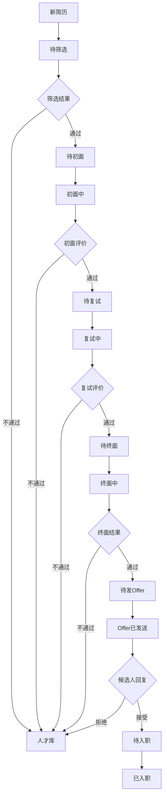

## 1. 产品概述

招聘流程管理系统（Recruitment Management System, RMS）是一款面向企业招聘场景的一体化协作平台，解决简历分散、面试协调困难、流程不透明等痛点。

- **核心问题**：简历分散在各邮箱、面试安排靠手工协调、候选人状态追踪混乱、招聘数据无法量化分析
- **目标用户**：HR招聘专员、面试官、用人部门负责人、高管
- **核心价值**：通过流程自动化和多角色协作，将招聘效率提升50%以上，实现招聘全流程数字化管理

## 2. 核心功能

### 2.1 用户角色

| 角色 | 注册方式 | 核心权限 |
|------|----------|----------|
| HR招聘专员 | 系统创建 | 职位管理、简历库管理、面试安排、全流程协调、数据分析 |
| 面试官 | 系统创建/邀请 | 查看候选人信息、填写面试评价、查看日程 |
| 用人部门负责人 | 系统创建 | 发布职位需求、查看候选人进度、参与终面评价 |
| 系统管理员 | 系统初始化 | 用户管理、角色权限配置、系统设置 |

### 2.2 功能模块

1. **工作台仪表盘**：待办事项、今日面试、招聘漏斗、数据概览
2. **简历管理**：简历导入/解析、简历库、标签分类、搜索筛选、简历评分
3. **职位管理**：职位发布、职位列表、职位详情、职位状态管理
4. **面试安排**：日程协调、会议室预订、面试提醒、视频面试集成
5. **面试评价**：评分维度、结构化评价、评价模板、评价汇总
6. **候选人追踪**：状态流转时间线、候选人详情、沟通记录、Offer管理
7. **数据分析报表**：招聘漏斗、渠道分析、面试官绩效、周期报表、人才库分析
8. **邮件通知中心**：邮件模板、自动触发、发送记录、通知配置

### 2.3 页面详情

| 页面名称 | 模块名称 | 功能描述 |
|-----------|-------------|---------------------|
| 登录页 | 登录表单 | 账号密码登录、记住密码、忘记密码 |
| 工作台 | 数据看板 | 待办事项卡片、今日面试、招聘漏斗图、快速入口 |
| 职位列表 | 职位管理 | 职位卡片列表、筛选、搜索、新建职位、状态切换 |
| 职位详情 | 职位信息 | 职位描述、候选人列表、面试进度、需求配置 |
| 简历库 | 简历管理 | 简历列表、高级搜索、标签筛选、批量导入、评分排序 |
| 候选人详情 | 候选人追踪 | 基本信息、简历预览、状态时间线、面试记录、评价汇总、沟通记录 |
| 面试安排 | 日程管理 | 日历视图、时间冲突检测、面试官选择、会议室预订、邮件通知 |
| 面试评价 | 评价管理 | 结构化评分、评价表单、模板选择、提交评价、历史评价查看 |
| 数据分析 | 报表中心 | 招聘漏斗图、渠道转化率、面试官绩效、周期统计、自定义报表 |
| 系统设置 | 配置管理 | 用户管理、角色权限、邮件模板、评价维度、流程配置 |

## 3. 核心流程

### 3.1 招聘主流程

HR收到用人需求 → 创建并发布职位 → 候选人投递/HR导入简历 → 简历筛选与初评 → 安排面试（多轮）→ 面试官评价 → 录用决策 → 发送Offer → 候选人入职

### 3.2 状态流转

## 4. 用户界面设计

### 4.1 设计风格

- **主色调**：深蓝色（#1e40af）代表专业与信任，搭配青绿色（#0d9488）作为流程进度强调色
- **辅助色**：琥珀色（#f59e0b）用于待办提醒，红色（#ef4444）用于风险提示，绿色（#10b981）表示通过/成功
- **按钮风格**：圆角6px，主按钮渐变填充，次按钮描边样式，悬停微上浮效果
- **字体**：标题使用 Inter SemiBold，正文使用 Inter Regular，数据展示使用 JetBrains Mono
- **布局风格**：左侧导航栏 + 顶部用户栏 + 主内容区的经典企业管理系统布局，卡片式信息组织
- **图标风格**：使用 Lucide Icons 线性图标，保持简洁专业

### 4.2 页面设计概览

| 页面名称 | 模块名称 | UI元素 |
|-----------|-------------|-------------|
| 登录页 | 品牌区+表单 | 品牌Logo、渐变背景装饰、卡片式登录表单、输入框动效 |
| 工作台 | 数据看板 | 数据卡片网格、漏斗图可视化、待办列表、今日日程时间轴 |
| 简历库 | 列表管理 | 顶部搜索筛选栏、左侧标签过滤、简历卡片列表、评分进度条 |
| 候选人详情 | 追踪页 | 左右分栏布局、左侧信息面板、右侧状态时间线、评价卡片堆叠 |
| 面试安排 | 日历页 | 周/月视图切换、时间格子拖拽、冲突高亮、侧边面试官选择器 |
| 数据分析 | 报表页 | Tab切换不同报表、ECharts图表、数据筛选器、导出按钮 |

### 4.3 响应式

- **桌面优先**：主要针对1440px及以上分辨率设计，满足HR日常办公场景
- **平板适配**：1024px时导航栏收缩为图标模式，卡片列数减少
- **移动端**：768px以下底部Tab导航，列表简化为紧凑模式，面试日程卡片化展示
- **触摸优化**：移动端按钮最小高度48px，列表项足够间距便于触控

