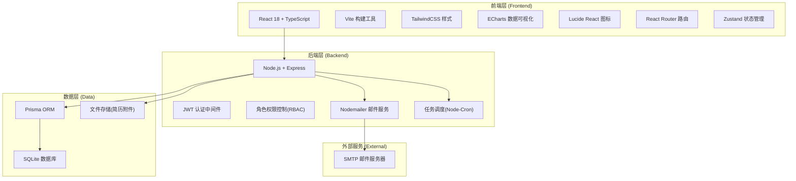
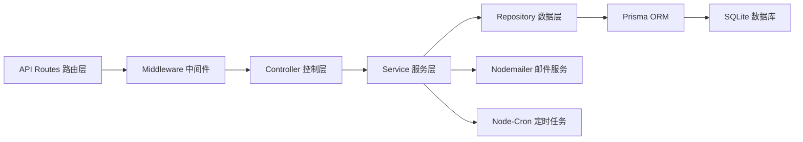
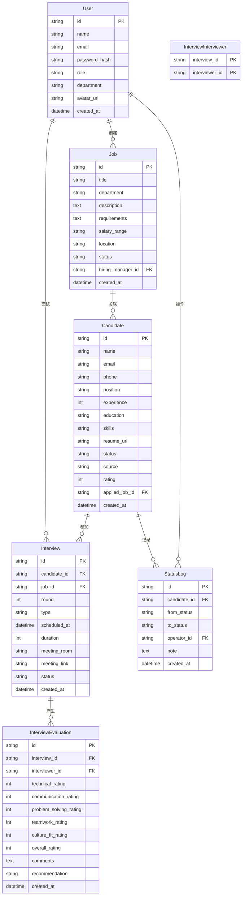

## 1. 架构设计



## 2. 技术说明

- **前端框架**：React@18 + TypeScript + Vite@5
- **样式方案**：TailwindCSS@3 + PostCSS
- **状态管理**：Zustand（轻量级，适合中后台系统）
- **路由管理**：React Router@6
- **UI组件**：自定义组件库 + Lucide React 图标
- **图表可视化**：ECharts@5
- **初始化工具**：Vite 官方脚手架
- **后端框架**：Express@4 + TypeScript
- **数据库**：SQLite（使用 Prisma ORM，方便后续迁移至 PostgreSQL）
- **认证方案**：JWT Token + 刷新令牌机制
- **邮件服务**：Nodemailer + SMTP
- **任务调度**：Node-Cron（面试提醒、自动通知）
- **Mock策略**：开发阶段使用内置 mock 数据，同时提供完整后端 API 实现

## 3. 路由定义

| 路由路径 | 页面名称 | 权限要求 |
|----------|----------|----------|
| /login | 登录页 | 公开 |
| /dashboard | 工作台仪表盘 | 登录用户 |
| /jobs | 职位列表 | HR/部门负责人 |
| /jobs/:id | 职位详情 | HR/部门负责人/面试官 |
| /resumes | 简历库 | HR |
| /candidates/:id | 候选人详情 | HR/面试官/部门负责人 |
| /interviews | 面试安排 | HR/面试官 |
| /interviews/:id/evaluate | 面试评价 | 面试官 |
| /analytics | 数据分析报表 | HR/管理员 |
| /settings | 系统设置 | 管理员 |

## 4. API 接口定义

### 4.1 类型定义

```typescript
// 用户类型
interface User {
  id: string;
  name: string;
  email: string;
  role: 'HR' | 'INTERVIEWER' | 'HIRING_MANAGER' | 'ADMIN';
  avatar?: string;
  department?: string;
  createdAt: Date;
}

// 职位类型
interface Job {
  id: string;
  title: string;
  department: string;
  description: string;
  requirements: string;
  salaryRange: string;
  location: string;
  status: 'DRAFT' | 'PUBLISHED' | 'CLOSED';
  hiringManagerId: string;
  createdAt: Date;
}

// 候选人类型
interface Candidate {
  id: string;
  name: string;
  email: string;
  phone: string;
  position: string;
  experience: number;
  education: string;
  skills: string[];
  resumeUrl: string;
  status: CandidateStatus;
  source: string;
  rating: number;
  appliedJobId: string;
  createdAt: Date;
}

type CandidateStatus = 
  | 'NEW' 
  | 'SCREENING' 
  | 'SCREENING_PASSED'
  | 'FIRST_INTERVIEW'
  | 'SECOND_INTERVIEW'
  | 'FINAL_INTERVIEW'
  | 'OFFER_PENDING'
  | 'OFFER_SENT'
  | 'OFFER_ACCEPTED'
  | 'OFFER_REJECTED'
  | 'HIRED'
  | 'REJECTED';

// 面试安排类型
interface Interview {
  id: string;
  candidateId: string;
  jobId: string;
  interviewerIds: string[];
  round: number;
  type: 'PHONE' | 'ONSITE' | 'VIDEO';
  scheduledAt: Date;
  duration: number;
  meetingRoom?: string;
  meetingLink?: string;
  status: 'SCHEDULED' | 'COMPLETED' | 'CANCELLED';
  createdAt: Date;
}

// 面试评价类型
interface InterviewEvaluation {
  id: string;
  interviewId: string;
  interviewerId: string;
  candidateId: string;
  ratings: {
    technical: number;
    communication: number;
    problemSolving: number;
    teamwork: number;
    cultureFit: number;
  };
  overallRating: number;
  comments: string;
  recommendation: 'HIRE' | 'CONSIDER' | 'REJECT';
  createdAt: Date;
}

// 状态变更记录
interface StatusLog {
  id: string;
  candidateId: string;
  fromStatus: CandidateStatus;
  toStatus: CandidateStatus;
  operatorId: string;
  note?: string;
  createdAt: Date;
}
```

### 4.2 核心接口

| 方法 | 路径 | 描述 |
|------|------|------|
| POST | /api/auth/login | 用户登录 |
| GET | /api/auth/me | 获取当前用户 |
| GET | /api/users | 用户列表 |
| POST | /api/users | 创建用户 |
| GET | /api/jobs | 职位列表 |
| POST | /api/jobs | 创建职位 |
| PUT | /api/jobs/:id | 更新职位 |
| GET | /api/candidates | 候选人列表 |
| POST | /api/candidates | 新增候选人/导入简历 |
| GET | /api/candidates/:id | 候选人详情 |
| PUT | /api/candidates/:id/status | 变更候选人状态 |
| GET | /api/interviews | 面试安排列表 |
| POST | /api/interviews | 创建面试安排 |
| PUT | /api/interviews/:id | 更新面试安排 |
| POST | /api/interviews/:id/evaluate | 提交面试评价 |
| GET | /api/analytics/funnel | 招聘漏斗数据 |
| GET | /api/analytics/source | 渠道分析数据 |
| GET | /api/analytics/interviewer | 面试官绩效 |

## 5. 后端服务架构



### 服务模块划分
- **AuthService**：认证、JWT生成、权限校验
- **UserService**：用户CRUD、角色管理
- **JobService**：职位管理、状态流转
- **CandidateService**：候选人管理、状态变更、简历解析
- **InterviewService**：面试安排、冲突检测、日程协调
- **EvaluationService**：面试评价、评分计算
- **NotificationService**：邮件通知、消息推送
- **AnalyticsService**：数据统计、报表生成

## 6. 数据模型

### 6.1 ER图



### 6.2 邮件通知触发配置

| 触发场景 | 接收人 | 邮件模板 | 发送时机 |
|----------|--------|----------|----------|
| 面试安排创建 | 候选人、面试官 | interview_scheduled | 实时 |
| 面试前1天提醒 | 候选人、面试官 | interview_reminder | 定时任务 |
| 面试评价提交 | HR相关人员 | evaluation_submitted | 实时 |
| 候选人状态变更 | HR、用人部门 | status_changed | 实时 |
| Offer发送 | 候选人 | offer_sent | 实时 |
| 候选人回复Offer | HR、用人部门 | offer_response | 实时 |
